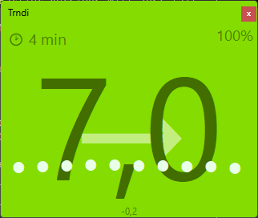
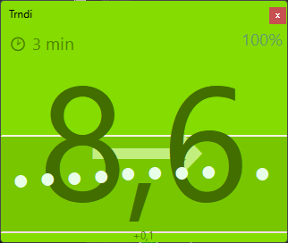
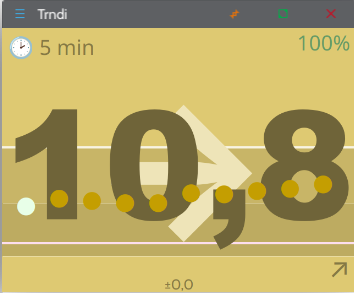
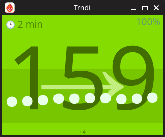
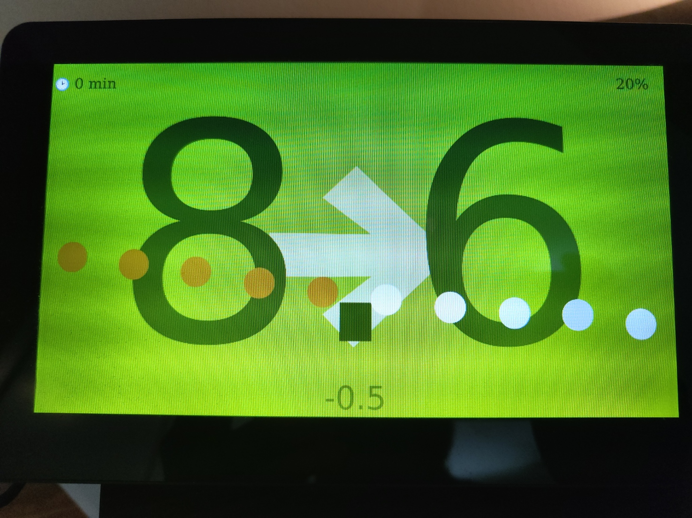

> ⚠️ _Quick intro:_ __Right-click__ on Trndi's window to open its menu for settings and other options!

[](https://github.com/slicke/trndi/actions/workflows/build.yml)


# Trndi - CGM data on Desktop and RaspberryPi<br><sup>_Nightscout - Dexcom - xDrip WiFi_</sup> 
## <b> 🪟 Windows - 🍎 macOS - 🐧 Linux - 🥧 RaspberryPi/ARM Linux

## Index
- [User Manual](MANUAL.md) - Complete guide for end users
- [Screenshots](#screenshots)
- [Introduction](#introduction)
- [What differs Trndi from apps?](#what-differs-trndi-from-apps)
- [Multi-user support](#multi-user-support)
- [Usage](#usage)
- [Installation](#installation)
	- [Windows](#windows)
	- [Linux](#linux)
	- [macOS](#macos)
  - [Haiku](#haiku)
  - [BSD](#bsd)
- [Setup](#setup)
- [Support](#support)
- [Development](#development)
	- [Building](#building)
	- [Command line](#command-line)
	- [Testing](#testing)
- [History](#history)
- [Linux notes](#Linux-support)
- [Settings storage](#settings-storage)
- [Contributing](#contributing)
- [Languages / Translations](#languages--translations)


### Screenshots


<br>Windows 11



<br>Fedora Linux


<br>RaspberryPi (with touch screen) - see [Guide for RPi display](guides/Display.md)

### Introduction
> __NEW__: Join us on [Discord](https://discord.gg/QXACfpcW)

Trndi is a _desktop app_ that shows your blood sugar and graph. It works with  _Night Scout_ and _Dexcom Share_ at the moment.
It also supports the _xDrip_ app, connecting over the local network/WiFi.

# What differs Trndi from apps?
* __Natively__ runs on your computer without needing installation
* Runs out-of-the-box! Does not depend on other software to be installed _(on [Linux](#Linux-support), this may depend on your distro)_
* Supports __multiple languages__
* Runs on your __Raspberry Pi__ and other arm computers, optionally as a full-screen display
* Works on __touch-screen__ devices, such as a RaspberryPi with screen
* Supports modern ___JavaScript__ extensions_
* __Small and portable__
* Supports dark and light color modes
* Displays your readings in a __trend graph__
* __Free__ and open source
* Integrates with Windows, macOS and Linux special features such as the macOS dock, Windows taskbar and Linux notifications.
* Supports low, normal and high blood sugar colors. But also __custom ranges__ such as "normal, but on the edge to high"
* Offers a [WebAPI](doc/WebAPI.md) for other clients to access glucose data
* Supports experimental [predictions](guides/Predictions.md)
* Supports Razer Chroma on Windows and Linux

### Multi-user support
Need to see more than one person? Trndi supports [parallel users](guides/Multiuser.md).
Setup the users in the _settings_. Don't forget to click _Save_ when editing users!

You need to start Trndi multiple times, each instance lets you choose a user. Just open the app multiple times and select a different account. Users can have different sources and run JavaScript plugins independently.

# Usage
⚠️ Right-click on the reading on the screen to access the menu, this is how you control Trndi.

# Installation

## Windows
### Via Installer (Recommended)
Download `TrndiSetup.exe` from the [latest release](https://github.com/slicke/trndi/releases) and run it.

### Portable (No install needed)
Download `Trndi-windows-x64.zip` from the [latest release](https://github.com/slicke/trndi/releases), extract and run `Trndi.exe`.

### Advanced: Via NuGet/Chocolatey (GitHub Packages)
You can install Trndi via NuGet from GitHub Packages (or Chocolatey), see the [guide](doc/NUGET.md).

## Linux
Download the appropriate package for your distribution from the [latest release](https://github.com/slicke/trndi/releases):
- **Debian/Ubuntu**: `trndi_VERSION_amd64.deb` or `trndi_VERSION_arm64.deb` — **Recommended** for best desktop integration
- **Fedora/RHEL**: `trndi-VERSION.x86_64.rpm` or `trndi-VERSION.aarch64.rpm` — **Recommended** for best desktop integration
- **AppImage** (Universal): `Trndi-x86_64.AppImage` or `Trndi-aarch64.AppImage` — **Recommended** for Arch, openSUSE, and other distributions
- **Portable**: `Trndi-linux-amd64.zip` or `Trndi-linux-arm64.zip`

### Package Recommendations

**Use native packages (.deb/.rpm) when available:**
- ✅ Better system integration
- ✅ Desktop extensions (GNOME/KDE) install to system locations automatically
- ✅ Automatic updates via package manager
- ✅ Proper uninstallation support

**Use AppImage for other distributions:**
- ✅ Works on any Linux distribution
- ✅ No installation required
- ✅ Portable and self-contained
- ℹ️ Desktop extensions need manual installation (see below)

### Using AppImage
```bash
# Download the AppImage for your architecture
wget https://github.com/slicke/trndi/releases/latest/download/Trndi-x86_64.AppImage

# Make it executable
chmod +x Trndi-x86_64.AppImage

# Run it
./Trndi-x86_64.AppImage
```

### Linux desktop indicators (optional)
- **GNOME**: includes a GNOME Shell top-bar extension (`trndi-current@slicke.com`) that shows the current reading.
- **KDE Plasma 6**: includes a panel widget ("Trndi Current") you can add via *Add Widgets*.

Both indicators read the same cache file: `${XDG_CACHE_HOME:-$HOME/.cache}/trndi/current.txt`.

**Installation:**
- **DEB/RPM packages**: Extensions install automatically to `/usr/local/share/trndi/`
- **AppImage**: Extensions are bundled but require manual installation:
  ```bash
  # Extract AppImage to access extensions
  ./Trndi-x86_64.AppImage --appimage-extract
  
  # GNOME: Copy to extensions directory
  mkdir -p ~/.local/share/gnome-shell/extensions
  cp -r squashfs-root/usr/share/trndi/gnome-shell-extension/trndi-current@slicke.com \
    ~/.local/share/gnome-shell/extensions/
  
  # KDE: Copy to plasmoids directory
  mkdir -p ~/.local/share/plasma/plasmoids
  cp -r squashfs-root/usr/share/trndi/kde-plasmoid/com.slicke.trndi.current \
    ~/.local/share/plasma/plasmoids/
  ```

## macOS
Download `Trndi-macos-silicon.dmg` from the [latest release](https://github.com/slicke/trndi/releases).

**Note**: After opening, you need to remove the quarantine attribute:
```bash
xattr -c /path/to/Trndi.app
```

## Haiku
Trndi can be built for Haiku OS using Lazarus. You can remove the mormot2 dependancy if compiling without extensions!

**Requirements:**
- Free Pascal Compiler: `pkgman install fpc`
- Lazarus build tools: `pkgman install lazarus_bin`
- OpenSSL for HTTPS support: `pkgman install openssl`

**Building from source:**
```bash
# Install dependencies
pkgman install fpc lazarus_bin openssl

# Clone and build
git clone https://github.com/slicke/trndi.git
cd trndi
lazbuild -B --widgetset=qt6 Trndi.lpi
```

**Features on Haiku:**
- Native notification support (via `notify-send` if available)
- Text-to-speech support (via `espeak` if available)
- Settings stored in `~/config/settings/Trndi/trndi.ini`
- HTTP/HTTPS support via FPC's TFPHTTPClient

## BSD
Trndi can be built for FreeBSD, OpenBSD, and NetBSD using Lazarus. 

**Requirements:**
- Free Pascal Compiler
- Lazarus build tools
- libcurl for HTTP/HTTPS support
- OpenSSL

**Building from source:**
```bash
# Install dependencies (FreeBSD example)
pkg install fpc lazarus curl openssl

# Clone and build
git clone https://github.com/slicke/trndi.git
cd trndi
lazbuild -B --widgetset=qt6 Trndi.lpi
```

**Features on BSD:**
- Native notification support (via `notify-send` if available)
- Text-to-speech support (via `espeak` if available)
- Settings stored in `~/.config/trndi/trndi.ini`
- HTTP/HTTPS support via libcurl

# Setup
Right click or click/hold the reading (or "Setup" text) and choose settings to access settings.
* For NightScout, settings will be fetched from your server and auto-applied
* For Dexcom, see the __[Dexcom setup guide](guides/Dexcom.md)__. The backend does not support all features, but this can be fixed with some manual work.
* For xDrip, you need to turn on the local web server and use that IP/password
* For other backends, feel free to contribute a api driver. See [API Drivers](guides/API.md)
* For HTTP API access, see the __[Web API documentation](doc/WebAPI.md)__ to expose glucose data to other applications

> _NOTE_ To receive notifications see [here](guides/Notifications.md)

> See a box instead of an icon? On Debian systems, you may need to install a graphic font. I recommend fonts-noto-color-emoji.

# Support
Join us on [Discord](https://discord.gg/QXACfpcW) to discuss issues or new features

# Development
Development tools can be obtained via most distros package managers:
- Fedora/RHEL: ```dnf install lazarus```
- Ubuntu/Debian: ```apt install lazarus```
- FreeBSD: ```pkg install editors/lazarus```

## Building
### GUI
Use the Lazarus IDE to build and/or develop the app, set release target in the _Project Options_.

### Command line

Build development:
```lazbuild Trndi.lpi``` 

Build release:
```lazbuild -dRelease Trndi.lpi``` 

Build to a release folder
```lazbuild -B output_directory Trndi.lpi``` 

### History
Trndi2 (and later) is a rewrite, less bloated, version of Trndi 1, which was never released publicly. Trndi 1 was originally called Dexmon (and only did Dexcom). The original idea spawns from an old app called TrayTrend which I made with a similar purpose.


### Testing
Trndi is actively tested on Windows (x64), Fedora Linux (amd64), Debian Linux (arm64 / Raspberry Pi).

<a name="Linux-support"></a>
## Linux notes
If you find yourself having problems running Trndi, i.e., it will not start, you might be missing the Qt6 framework and/or the pascal headers.

#### Any distro
You can download them for any RPM/DEB distro in this [repo](https://github.com/davidbannon/libqt6pas/releases).

#### Debian / Raspbian
You can install the ```libqt6pas6``` package on Debian-based distros via ```apt```.

#### Ubuntu
You can install the ```libqt6pas6``` package via ```apt```.

#### Fedora
You can install the ```qt6pas``` package in ```DNF```.

#### Arch
You can install the ```qt6pas``` package.

#### Others
Look for ```qt6pas``` or ```libqt6-pas``` (or ```qt6pas6```) in your package manager, or search for ```libQt6Pas.so```.

## Settings storage
Trndi stores settings per platform in the standard location:
- Windows: Registry under HKCU\Software\Trndi
- macOS: NSUserDefaults (Preferences), typically domain com.slicke.Trndi (often stored in ~/Library/Preferences/com.slicke.Trndi.plist)
- Linux: Lazarus GetAppConfigFile path, typically ~/.config/Trndi/trndi.ini in section [trndi]

On Linux, this is a single INI file consistently used for Get/Set/Delete operations — no legacy paths or multiple files.

## Contributing
Contributions are welcome. Please read [CONTRIBUTING](CONTRIBUTING.md) for coding style, PasDoc guidelines, and how to generate the developer docs for native, extensions, and API units.

If you're adding or modifying an API driver, start with the [API guide](guides/API.md) for the contract and examples, then follow the API section in CONTRIBUTING.

_See also [BUILDING.md](guides/BUILDING.md)_

## Languages / Translations
To contribute a translation, checkout [LANGUAGES.md](LANGUAGES.md).