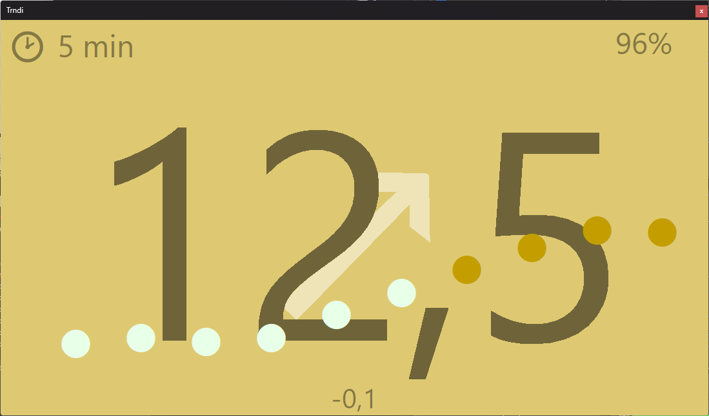

# <br> Trndi - CGM data on desktop and RaspberryPi<br><sup>_Nightscout - Dexcom - xDrip WiFi_</sup> 
<b> Windows - macOS - Linux - RaspberryPi </b>

Swedish Windows

Linux (Qt6)
### Introduction
Trndi is a _desktop app_ that shows the your blood sugar and graph. It works with  _Night Scout_ and _Dexcom Share_.
It also supports the _xDrip_ app, connecting over the local network/WiFi.

# What differs Trndi from apps?
* __Natively__ runs on your computer without installation or other software _(on Linux, this may depend on distro)_
* Supports __multiple languages__
* Runs on your __Raspberry Pi__ and other arm computers, optinally as a full-screen display
* Works on __touch-screen__ devices
* Supports modern ___JavaScript__ extensions_
* __Small and portable__
* Supports dark and light color modes
* Displays your readings in a __trend graph__
* __Free__ and open source
* Integrates with Windows, macOS and Linux special features such as the macOS dock, Windows taskbar and Linux notifications.
* Linux: Supports both Qt6 and GTK2
* Supports low, normal and high glood sugar colors. But also __ranges__ such as "normal, but on the edge to high"

### Multi-user support
Got more than one diabetic? Trndi supports parallel users.

# Setup
Click/hold the reading (or "Setup" text) and choose settings to access settings.
* For NightScout, settings will be fetched from your server and auto-applied
* For Dexcom, see the __[Dexcom setup guide](guides/Dexcom.md)__. The backend does not support all features, but this can be fixed with some manual work.
* For xDrip, you need to turn on the local web server and use that IP/password
* For other backends, feel free to contribute a api driver. See [API Drivers](guides/API.md)

> _NOTE_ To receive notifications see [here](guides/Notifications.md)

> See a box instead of an icon? On Debian systems, you may need to install a graphic font. I recommend fonts-noto-color-emoji.

# Development
Development tools can be obtained via most distros package managers:
- Fedora/RHEL: ```dnf install lazarus```
- Ubuntu/Debian: ```apt install lazarus```
- FreeBSD: ```pkg install editors/lazarus```

## Building
### GUI
Use the Laarus IDE to build and/or develop the app, set release target in the _Project Options_.

### Command line

Build development:
```lazbuild Trndi.lpi``` 

Build release:
```lazbuild -dRelease Trndi.lpi``` 

Build to a release folder
```lazbuild -B output_directory Trndi.lpi``` 


## Dependancies
### JS
The JS engine, _QuickJS_, is linked into Trndi.

You need the relevant library files, placed in ../static when compiling.
> You can get the recommended libraries from https://synopse.info/files/mormot2static.7z - you may remove libraries you don't need!
Due to mormot2, the support library Trndi uses, it may currently not be possible to run extensions under ARM64 computers.

### Qt6 on Raspberry Pi
You need the libqt6pas packages from https://github.com/davidbannon/libqt6pas/releases to compile Trndi

## Style
### Linter
Trndi uses __JEDI__ to format code, in Lazarus: Source > JEDI Code Format > Global Settings. Choose _JCFSettings.xml_

### Naming
Units should end with ```.pp```, 

### VSCode
Should you choose not to use Lazarus IDE, these are the recommendations for Visual Studio Code:
* Language Support: https://marketplace.visualstudio.com/items?itemName=alefragnani.pascal

* Formatting: Name: Pascal Formatter
VS Marketplace Link: https://marketplace.visualstudio.com/items?itemName=alefragnani.pascal-formatter

* Debugging: https://marketplace.visualstudio.com/items?itemName=CNOC.fpdebug

### History
Trndi2 is a rewrite, less bloated, version of Trndi 1, which was never released publically. Trndi 1 was originally called Dexmon (and only did Dexcom). The original idea spawns from an old app called TrayTrend which I made with a similar purpose.


### Testing
Trndi is actively tested on Windows (amd64), Fedora Linux(amd64), Debian Linux(arm64 / Raspberry pi).

### IMPORTANT: RaspberryPi / ARM64
To compile with extension support, you have to add ```{$DEFINE LIBQUICKJSSTATIC}``` in ```mormot.defines.inc``` 