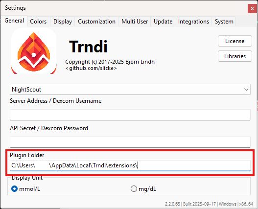
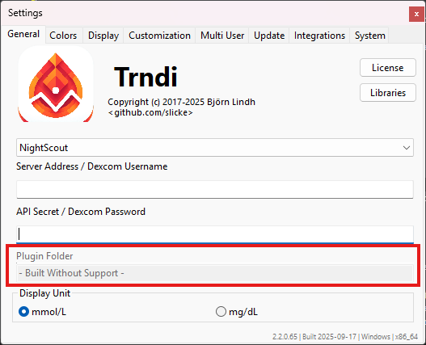

# Getting started with Plugins
Full reference of functions in [Extensions Functions](Extensions_functions.md)

### Plugin folder
The _plugin folder_ is located in your system's application data. You can find out where exactly in the settings.



### Plugin support
Trndi can be built without plugin support; if that's the case the settings will show a message. This will result in a smaller program file. Most commonly, plugins are disabled on systems where the JavaScript engine cannot run reliably.



# Creating a plugin
To create, or install, a plugin - create/place a ```.js``` file in the plugin folder. It will automatically load on the next run.

### Custom levels ("Dexcom example")
This example demonstrates how to set custom high, low and a range via a plugin.

While this can be used for any backend, it's especially useful for _Dexcom_ as the backend does _not provide this info_, while NightScout provides these values itself:

```javascript
setLimits(3.2, 10.4);
```
In this example, we declare that:
* Readings under 3.2 are low
* Readings over 10.4 are high

We can also set the preferred values:
```javascript
setLimits(3.2, 10.4, 4.1, 8.7);
```
This adds that:
* We prefer values over 4.1
* We prefer values under 8.7

### Color example
We can also change the high/low colors displayed:
```javascript
Trndi.setLevelColor('#7cd55d','#d55d5d', '#5dc6d5'); // Set colors for okay readings, high readings and low readings with HTML colors
```

You can also set colors for the dots in the graph, by adding three more colors:
```javascript
Trndi.setLevelColor('#7cd55d','#d55d5d', '#5dc6d5', // Set colors for okay readings, high readings and low readings with HTML colors
                    '#7cd55d','#612828', '#5d75d5'); // Colors for the dots (ok, hi, lo)
```

Lastly, you can set the warning colors for when the blood sugar exceeds or goes under the "preferred" level:
```javascript
Trndi.setLevelColor('#7cd55d','#d55d5d', '#5dc6d5', // Set colors for okay readings, high readings and low readings with HTML colors
                    '#7cd55d','#612828', '#5d75d5', // Colors for the dots (ok, hi, lo)
                    '#ffbfbf', '#bffff9'); // Color for the custom levels set in NightScout (or via JS) (hi, lo)
```