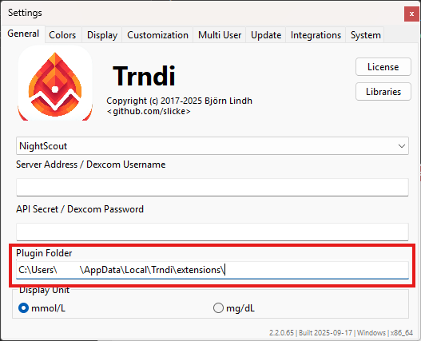
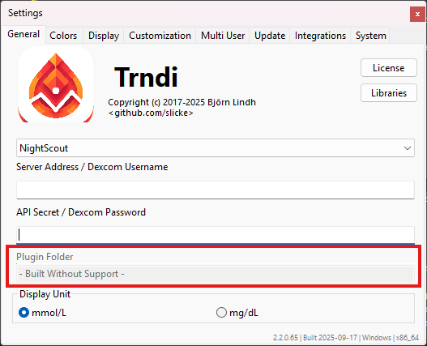

# Getting started with Plugins
Full reference of functions in [Extensions Functions](Extensions_functions.md)

### Plugin folder
Plugins are placed in the _plugin folder_. You can find out where it is in Trndi's settings:



### Plugin support
Trndi can be built without plugin support aswell; if so, the box is grayed-out:

> Official versions of Trndi support extensions on Windows and Linux (__amd64/x64__). Due to limitations in the engine Trndi uses, extensions are not supported on __arm__(64) platforms such as RaspberryPi and macOS.



# Creating/Installing a plugin
To create, or install, a plugin - create/move a ```.js``` file in/to the plugin folder. It will automatically load on the next start of Trndi.
> If you are using multiple users in Trndi, plugins will run independently, "sandboxed", per user.

# Writing an extension
 See the full reference of functions in [Extensions Functions](Extensions_functions.md)

# Info and Copyright
To have your extensions show their name and copyright, add a header at the very start:
```
/* My Extension
(c) My Name*/
```
If no /* is present, the plugin will not show any info. If your first row is another comment it might be shown as copyright.

# Permissions
Each extension now runs in its own isolated JavaScript context with only the
functions it has permission to use. Permissions are coarse groups; some are
granted automatically, others must be declared in the header and approved by
the user the first time the extension is loaded.

## Baseline (always granted, no prompt)
- **`data`** — read glucose data and app info (`getReading`, `getCurrentReading`, `getLimits`, `getStatistics`, `getBasalRate`, `getUnit`, `getLocale`, `getBuild`, `getCurrentAPI`, `getCurrentUser`, `getCurrentNickname`, `predictReadings`)
- **`ui`**  — dialogs and visual changes (`alert`, `confirm`, `prompt`, `select`, `log`, `console.*`, `htmlMsg`, `htmlDlg`, `htmlYesNo`, `attention`, `playSound`, `sayText`, `setBadgeSize`, `setDotSize`, `setDotAdjust`, `setLevelColor`, `setClockInterval`, `uxProp`)
- **`timers`** — schedule callbacks (`setTimeout`, `setInterval`, `clearTimeout`, `clearInterval`)

## Promptable (must be declared; user approves on first load)
- **`net`**      — make network requests (`fetch`, `asyncGet`, `asyncPost`, `jsonGet`)
- **`exec`**     — run external programs (`runCMD`)
- **`settings`** — read/write Trndi settings and CGM thresholds (`getSetting`, `setSetting`, `setLimits`, `setTimeAndRange`, `setOverrideThresholdMinutes`)

## Declaring permissions
Add an `@perms` line inside the header comment block, listing the promptable
groups your extension needs:

```javascript
/* My Extension
(c) My Name
@perms net, exec
*/
```

On the next start, Trndi will show a dialog naming the extension and the
requested groups; click **Yes** to allow it to load, **No** to skip it for this
session. The decision is stored alongside the file's SHA-256 — if the file is
edited later, you'll be prompted again.

## Migrating older extensions
Extensions written before per-extension permissions need an `@perms` line if
they use any promptable function. Without it the function will not be defined
in the script's context and you'll see `ReferenceError: asyncGet is not
defined` (or similar) at runtime. Add the matching group to `@perms`, reload,
and approve at the prompt.