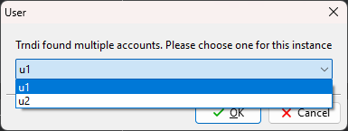

# MULTI USER IS NOW BUIT-IN!
## You can setup multi user in Trndi's settings, this guide is old!
# Monitoring multiple persons
## Important notes
 Users has to be _manually_ defined, it can't be done through the user interface at this time

## How to add
### Linux
Open Trndis config file (```~/.config/Trndi.cfg```) and add the names, separated by commas:
```
[users]
names=one,two
```

### Windows
Open the registry and find the ```HKEY_CURRENT_USER\Software\Trndi``` key. 

There, add a string value called ```users.names```. Add the users, separated by comma - for instance ```one,two```

## How to use


Once the names have been added, Trndi will show a dialog when starting - asking which user to use. You can configure each user in Trndi, start multiple instances and choose a different user for each.

The titlebar will change from Trndi to [username] Trndi for any non-default user. Note that the default user is still available, if you click Cancel.
